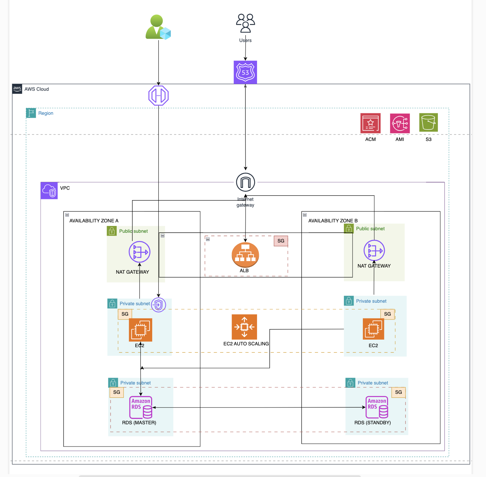

# Dynamic_Web_App
Dynamic Web Application
This project is a Dynamic Web Application deployed on AWS, showcasing the integration of various AWS services for a secure, scalable, and highly available web infrastructure. The application uses Terraform for Infrastructure as Code (IaC), enabling seamless automation and management of AWS resources.

Key Features:
Highly Scalable: Uses Auto Scaling to ensure that the application can scale based on demand.
High Availability: Deployed across multiple Availability Zones to ensure fault tolerance.
Secure: Implements VPC, Security Groups, and AWS Certificate Manager for secure communication.
Efficient Traffic Distribution: Utilizes Application Load Balancer for distributing traffic across instances.
Automation: Deployed and managed using Terraform for Infrastructure as Code.
Architecture Overview:
The project follows a robust architecture leveraging various AWS services, ensuring that the application is highly available, secure, and scalable.

Key Components:
Virtual Private Cloud (VPC): Provides a secure, isolated network environment for the application.
Internet Gateway: Allows communication between the instances and the internet.
Security Groups: Ensures tight security by controlling inbound and outbound traffic.
Auto Scaling Group: Scales EC2 instances up and down to handle varying traffic loads.
Application Load Balancer: Distributes incoming traffic to multiple instances to balance the load.
Route 53: DNS service for routing traffic efficiently.
S3 Bucket: Stores static assets like images, CSS, and Terraform state files.
Amazon RDS: Provides a highly available and scalable relational database service.
AWS Certificate Manager (ACM): Manages SSL/TLS certificates for secure communication.
How to Run:
Clone this repository to your local machine:

bash
Copy
Edit
git clone https://github.com/dushf12/Dynamic_Web_App.git
Follow the setup instructions for Terraform and AWS services in the setup_instructions.md (if applicable).

Deploy the infrastructure with Terraform:

bash
Copy
Edit
terraform init
terraform plan
terraform apply
After deployment, you can access the dynamic web application via the provided URL from AWS Route 53.

Architecture Diagram:
Here’s the visual representation of the architecture used in the project. It provides an overview of how the different AWS services integrate together to form a highly available and scalable solution.

